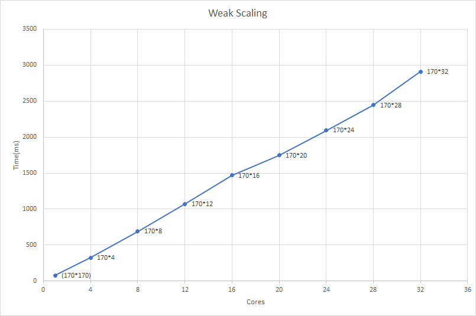

## Programmazione Concorrente, Parallela e su Cloud
### Università degli Studi di Salerno - Anno Accademico 2016/2017
#### Prof: Vittorio Scarano
#### Dott. Carmine Spagnuolo
|Studente  |Matricola  |
|--|--|
|  Dario Di Pasquale | 0522500433 |

## Problema
Risolvere l'equazione di Laplace in due dimensioni con differenze finite utilizzando MPI. 

Per computare una approssimazione della soluzione dell'equazione di Laplace è necessario effettuare la seguente operazione:

    while (not converged) {
      for (i,j)
        xnew[i][j] = (x[i+1][j] + x[i-1][j] + x[i][j+1] + x[i][j-1])/4;
      for (i,j)
        x[i][j] = xnew[i][j];
      }

Questa operazione assegna ad ogni elemento della matrice *xnew* la media dei valori attorno ad esso e, al termine di questa operazione, sostituisce i valori della matrice originale *x* con i valori della matrice *xnew* così calcolati.
Questa operazione va tuttavia effettuata solo per i punti centrali, non considerando i bordi della matrice. Quindi, supponendo una matrice *n*n*, i valori

    x[0][j]
    x[n-1][j]
    x[i][0]
    x[i][n-1]

sono fissati.
Poichè i valori sono sostituiti con la media dei valori attorno ad essi, questa tenica è chiamata *relaxation method*.
Per effettuare il test di convergenza calcoliamo:

    diffnorm = 0;
    for (i,j)
        diffnorm += (xnew[i][j] - x[i][j]) * (xnew[i][j] - x[i][j]);
    diffnorm = sqrt(diffnorm);

Quando `diffnorm` è minore di *1.0e-4* oppure sono state raggiunte le 100 iterazioni, allora è stata 
raggiunta la convergenza e si esce dal loop.
Occore fare uso delle operazioni di comunicazione collettiva di MPI.
## Solzione proposta
Vista la natura del problema, una possibile soluzione prevede il partizionamento della matrice in righe, tutte composte dallo stesso numero di colonne, distribuite tra i vari nodi.

Ogni nodo, quindi, opererà in locale solo su *(numero di righe)/(numero di processori)* righe. 
È, tuttavia, opportuno notare che, per calcolare i valori delle proprie righe, ogni processore *i* (tranne il primo) avrà bisogno di accedere all'ultima riga del processore precedente (*i-1*) e, allo stesso modo, ogni processore, tranne l'ultimo *i* avrà bisogno della prima riga del processore successivo (*i+1*). Queste righe, tuttavia, occorrono solo come punti estremi per il calcolo degli elementi delle righe: tali valori non saranno calcolati in *xnew* e non rientrano quindi nel numero locale di righe per ogni processore.
Per il motivo succitato, occorre creare una topologia nella quale ogni processore passa le righe necessarie agli altri nodi. Tale topologia è illustrata nell'immagine seguente, mostrando, come esempio, solo quattro processori. Le frecce verdi indicano il passaggio dell'ultima riga, le frecce rosse indicano il passaggio della prima riga.

Per il calcolo della convergenza, possiamo calcolare indipendentemente *diffnorm* per ogni matrice ed infine sommare questi valori in ogni processore ed applicare l'operazione di radice quadrata. Questa operazione è possibile dato che *diffnorm* è la somma dei quadrati della differenza tra il valore di *xnew* ed il valore di *x* per una coppia di indici *(i,j)*, quindi è possibile calcolare tale valore per ogni sottomatrice ed infine sommarla.
### Implementazione
La prima operazione da effettuare è il calcolo degli indici:

    const int procgridsize = gridsize / num_proc; // size of process grid
      int additional_rows = 2;
      if (rank == 0) {
        additional_rows--;
      }
      if (rank == num_proc - 1) {
        additional_rows--;
      }
      int first_local_row = rank == 0 ? 0 : 1;
    int last_local_row = rank == 0 ? procgridsize - 1 : procgridsize;
    
Il valore `procgridsize` è il numero di righe per ogni processore;
Il valore di `additional_rows` corrisponde al numero di righe extra (le righe superiori ed inferiori che saranno utilizzate per il calcolo di *xnew*) per ogni processore;
Il valore di `first_local_row` serve per distinguere il processore 0 (quello che non avrà bisogno di recuperare la prima riga per il calcolo di *xnew*) dagli altri processori: tali processori devono lasciare la prima riga vuota dal momento che questa appartiene ai processori successivi.

Dopo aver calcolato gli indici, vengono allocate e generate le matrici per *x* e per *xnew*, dopodiché si entra nel ciclo principale, nel quale si calcola la matrice.
La prima operazione effettuata nel ciclo principale è lo scambio delle righe ai bordi seguendo la topologia illustrata in precedenza. Tale scambio fa uso delle funzioni `MPI_Send` e `MPI_Recv` di MPI.
Una volta che i processori hanno ricevuto le righe necessarie, avviene il calcolo di *xnew*, di *diffnorm* e successivamente di sostituiscono gli elementi interni di *x* con quelli di *xnew*:

    for (int i = first_i; i <= last_i; i++) {
          for (int j = 1; j < gridsize - 1; j++) {
            xnew[i][j] = (local[i][j + 1] + local[i][j - 1] 
                + local[i + 1][j] +local[i - 1][j]) / 4.0;
            diffnorm += (xnew[i][j] - local[i][j]) * (xnew[i][j] - local[i][j]);
          }
        }
        for (int i = first_i; i <= last_i; i++) {
          for (int j = 1; j < gridsize - 1; j++) {
            local[i][j] = xnew[i][j];
          }
    }
Il calcolo viene effettuato, come si può notare, solo per le righe interne della sottomatrice.
Per il calcolo dell'interno *diffnorm* utilizziamo la funzione `MPI_Allreduce` di MPI:

    MPI_Allreduce(&diffnorm, &global_diffnorm, 1, MPI_DOUBLE, MPI_SUM, MPI_COMM_WORLD);
    global_diffnorm = sqrt(global_diffnorm);
La funzione `MPI_Allreduce` combina i valori da tutti i processori e distribuisce indietro il risultato tra tutti i processori. 
L'utilizzo di questa funzione, invece di `MPI_Reduce`, è motivato dal fatto che, quest'ultima effettua un'operazione sui valori da tutti i processore ma ne utilizza il valore su un singolo processore, mentre, per il nostro problema, abbiamo bisogno che ogni processore abbia questo valore, in modo da poter terminare il ciclo principale una volta raggiunta la convergenza.

## Benchmarking
I benchmark sono stati condotti utilizzando delle macchine m4.xlarge di Amazon AWS, una configurazione di istanza avente quattro processori Intel Xeon® E5-2686 v4 (Broadwell) da 2,3 GHz e 16GB di memoria RAM.
Sono stati eseguiti due tipologie di test:
- **Strong Scaling**: La dimensione del problema è rimasta costante e sono stati effettuati i test aumentando il numero dei processori. 

Come si può vedere dal grafico sottostante, il tempo diminuisce con il crescere del numero di processori utilizzati.

 
 

- **Weak Scaling**: Questo test è stato effettuato mantenendo costante il carico per ogni processore (i.e. 170 righe per processore), ed aumentando contemporaneamente sia la taglia del problema che il numero di processori.

Come si può vedere nel grafico sottostante, il tempo aumenta con l'aumentare della taglia del problema e del numero di processori.

 

